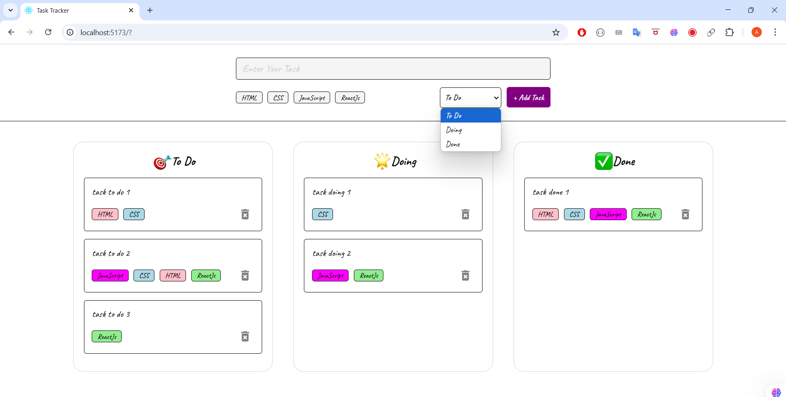

# React.js Task Tracker

> A simple To-Do List application built with React, allowing users to add and delete their tasks with tags.

---

## Features

- Add tasks
- Add tags to task  
- Delete tasks 
- Tasks are auto-saved and loaded from LocalStorage

---

## Preview

---

## Demo

---

## Technologies Used

- [React](https://reactjs.org/)  
- [Vite](https://vitejs.dev/)
- CSS  
- HTML  
- JavaScript  
- LocalStorage  

---

## How to Run the Project

1. Clone repo
2. Install dependencies (npm install)
3. Run dev server (npm run dev)